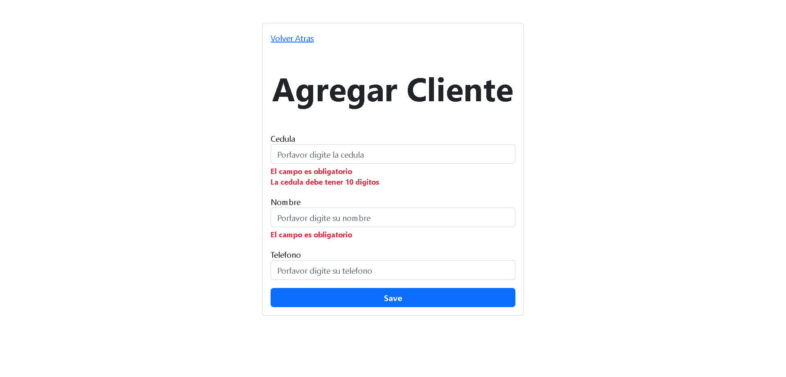
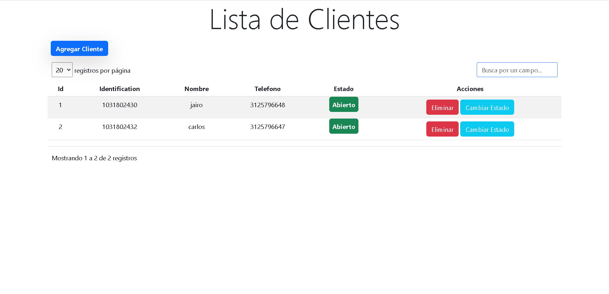
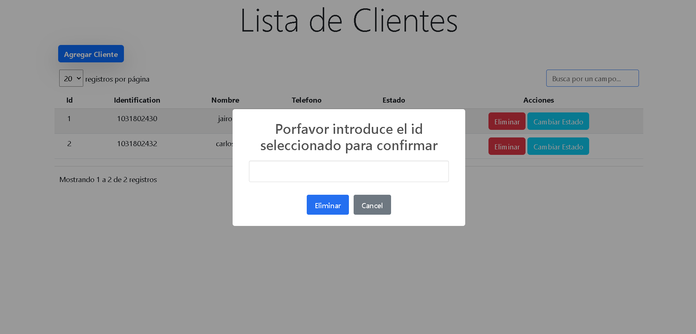

# senasoft test

>John Gualteros,
>Andres Meza,
>Stive Ospina

```git
git clone "https://github.com/johngualteros/prueba-senasoft.git"
```
```git
git checkout master
```

# **Initialize the project**

### before create the database

```sql
CREATE DATABASE senasoft;
```


